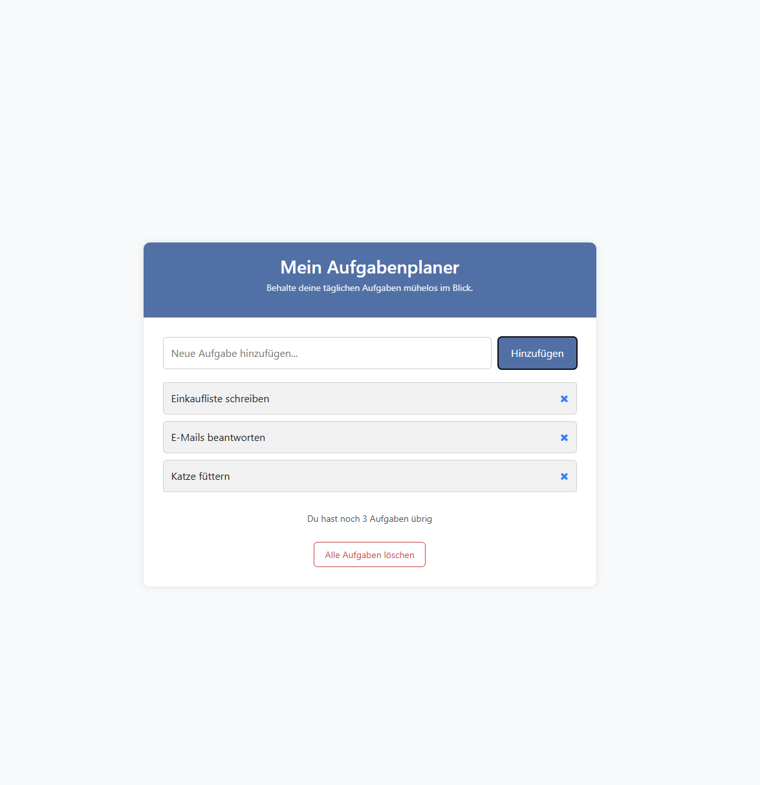

# 🗂️ AufgabenPlaner

**AufgabenPlaner** ist eine einfache ToDo-Webanwendung, mit der du deine täglichen Aufgaben verwalten kannst.  
Du kannst Aufgaben hinzufügen, löschen und die Liste wird automatisch im Browser gespeichert.

---

## 🚀 Funktionen

- Aufgaben hinzufügen und löschen
- Aufgaben werden im localStorage gespeichert (bleiben auch nach dem Schließen erhalten)
- Dynamische Anzeige, wenn keine Aufgaben vorhanden sind
- Automatische Zählung der verbleibenden Aufgaben
- Rückmeldung mit farbigen Hinweismeldungen (Bootstrap-Alerts)

---

## 🖥️ Vorschau

  
*Beispielhafte Darstellung der Aufgabenliste*

---
## 🌐 Live-Demo

Hier kannst du die Anwendung direkt ausprobieren:  
👉 [AufgabenPlaner Live ansehen](https://yuekselim.github.io/Todo/)

---

## ⚙️ Technologien

- HTML5
- CSS3 (inkl. Bootstrap)
- JavaScript (ES6)
- localStorage

---

## 📂 Verwendung

1. Projekt-Dateien (`index.html`, `app.js`, ggf. `style.css`) lokal speichern  
2. `index.html` in einem Browser deiner Wahl öffnen  
3. Aufgaben direkt im Browser eingeben und verwalten  
(keine Installation notwendig)

---

## 👨‍💻 Über das Projekt

Dieses Projekt wurde im Rahmen meines Lernprozesses entwickelt, um DOM-Manipulation, Event-Handling und lokale Speicherung in JavaScript zu üben.  
Teile der Struktur und Lösungsansätze wurden mithilfe moderner Tools wie **ChatGPT** entwickelt, geprüft und verbessert.

---

## 📜 Lizenz

Dieses Projekt steht unter keiner speziellen Lizenz. Frei zur privaten Nutzung oder Weiterentwicklung.

---
